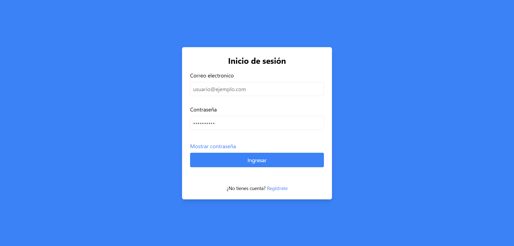
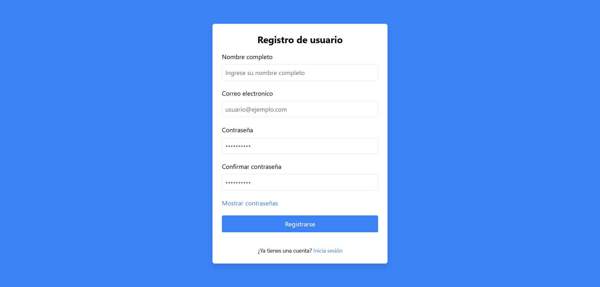
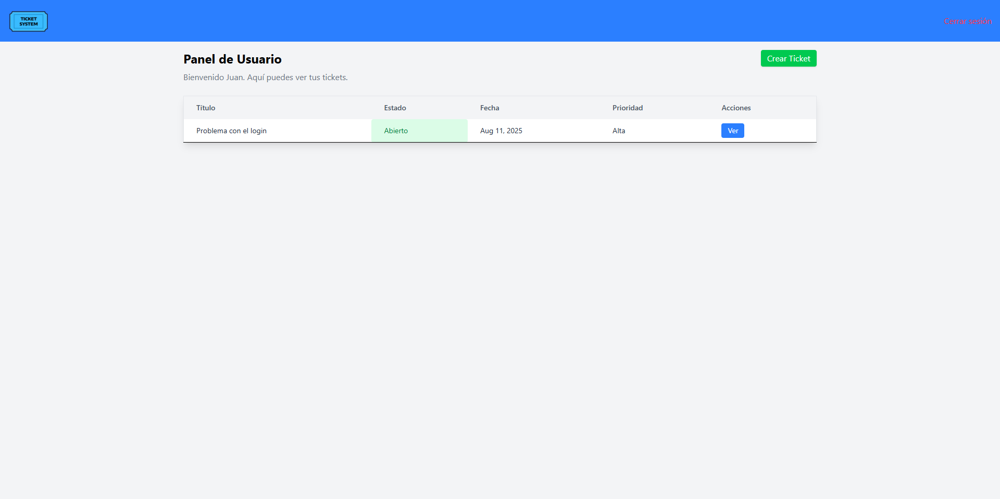
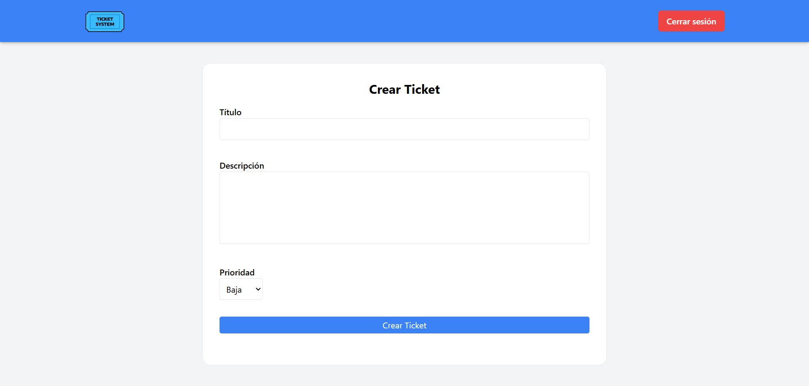
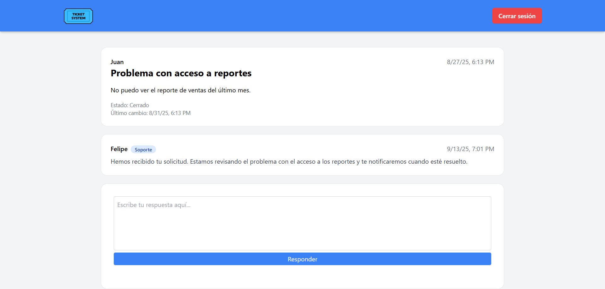
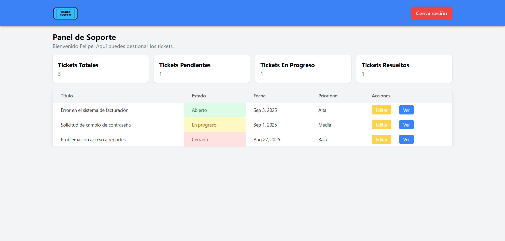
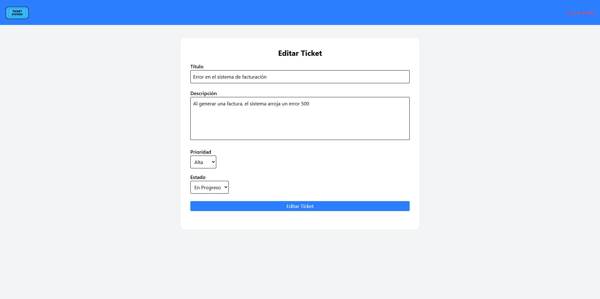
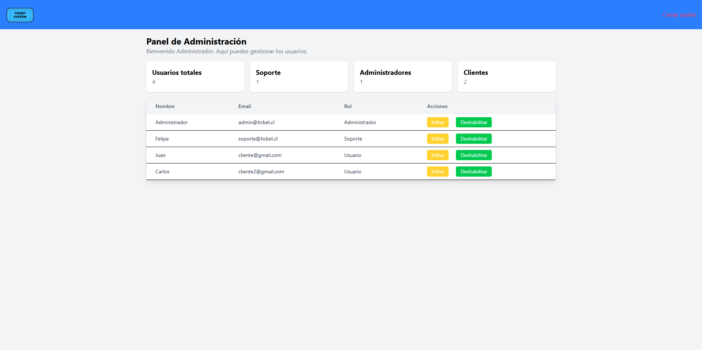
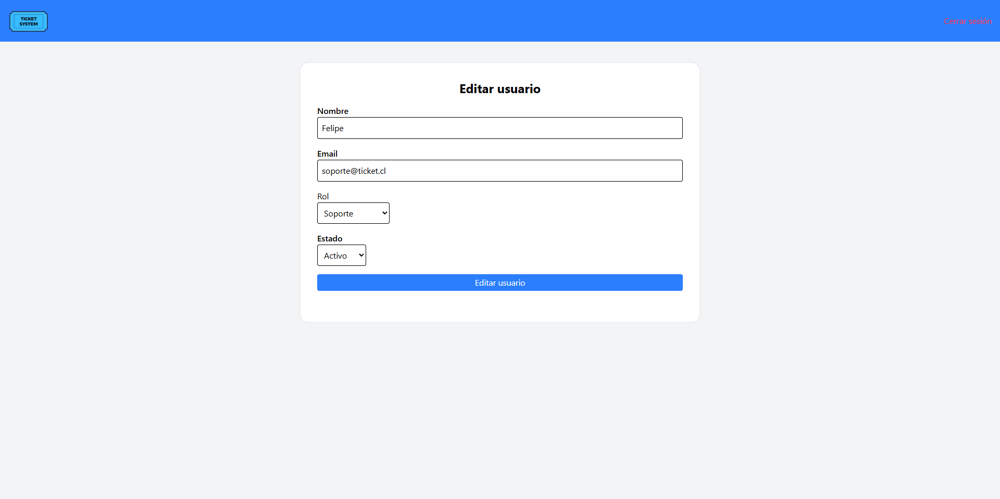

# 📋 Sistema de Tickets - Frontend

Este proyecto corresponde al frontend de un Sistema de gestión de Tickets desarrollado con Angular. Permite a los usuarios registrar tickets y hacer seguimiento a sus respuestas por parte del equipo de soporte. Incluye manejo de roles, autenticación y vistas basadas en rol.

## 🧪 Tecnologías usadas
- Angular 17.3.17
- TailwindCSS 3.4.17
- TypeScript
- HTML

## ✨ Características
- Registro e inicio de sesión de usuarios
- Creación y visualización de tickets
- Respuestas y actualizaciones en tiempo real
- Manejo de roles: Usuario, Soporte y Administrador
- Gestión de Usuarios (Administrador) y de tickets (Soporte)

## 📋 Requisitos previos
- Contar con el backend de [este repositorio](https://github.com/Alejandro-VH/ticketSystem-backend)
- [NodeJS](https://nodejs.org/en/download/current)
- Disponibilidad del puerto 4200
- AngularCLI (`npm install -g @angular/cli@17`)

## ⚙️ Instalación
1. Clonar repositorio:
```bash
git clone https://github.com/Alejandro-VH/ticketSystem-frontend.git
cd ticketSystem-frontend
```
2. Instalar dependencias
```bash
npm install
```
3. Iniciar el servidor
```bash
ng serve
```

4. Ingresar desde el navegador a
```bash
http://localhost:4200/
```

## 📂 Estructura del proyecto
```
src/
├── app/
│   ├── guards/          # Guards para la protección de rutas
│   ├── interceptor/     # Interceptores HTTP
│   ├── interfaces/      # Modelos de los objetos
│   ├── pages/           # Componentes de vistas agrupados por roles y funcionalidades
│   │   ├── admin/       # Componentes de administradores (dashboard y editar usuarios)
│   │   ├── auth/        # Componentes de autenticación (login, registro)
│   │   ├── home/        # Página principal (redireccion por roles)
│   │   ├── support/     # Componentes del equipo de soporte (dashboard y editar tickets)
│   │   └── user/        # Componentes de usuarios comunes (home y crear tickets)
│   ├── services/        # Servicios para manejar las llamadas a la api
├── shared/              # Componentes compartidos
│   ├── components/      
│   └── tickets/         
├── app.component.*      # Componente principal y sus variantes (css,html,ts)
├── app.config.ts        # Archivo de configuración general
└── app.routes.ts        # Rutas de la aplicación
```
## 📸 Capturas de pantalla
_Pantalla de inicio de sesión_
  

_Pantalla de registro_
  

_Vista principal para usuarios_
 

_Formulario para crear tickets_
  

_Detalles del ticket_
  

_Vista principal para equipo de soporte_
  

_Formulario para editar tickets_
  

_Vista principal para administradores_
  

_Formulario para editar usuarios_
  

## 🔮 Futuras mejoras
- [ ] Realizar una demo online
- [ ] Organizar de mejor manera las tablas que contienen usuarios y tickets
- [ ] Agregar paginación a las tablas

## 👤 Autor
#### Alejandro Villarroel
Estudiante de Ingeniería en Computación e Informática
- [Linkedin](https://www.linkedin.com/in/alevillarroel/)
